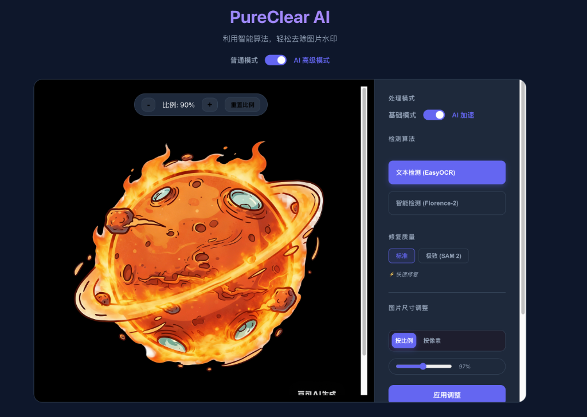

# Dobby 多比 - 智能图片修复小精灵



Dobby 多比 是一款功能强大的本地化图片去水印工具，结合了最新的计算机视觉和深度学习技术，提供从手动涂抹到全自动 AI 识别的多种解决方案。它不仅支持普通图片，还能完美处理带有**透明背景 (Alpha 通道)** 的图片。

## ✨ 核心功能

### 1. 基础模式 (手动涂抹)
适合简单的修补任务或对 AI 结果微调。
- **操作方式**：使用画笔工具手动涂抹需要去除的水印区域。
- **技术原理**：基于 OpenCV 的 Telea 算法（快速行进法），通过计算周围像素的加权平均值来修补缺失区域。

### 2. AI 高级模式 (全自动)
一键识别并去除水印，无需手动操作。
- **多种检测算法**：
    - **文本检测 (EasyOCR)**：专门针对文字水印优化，支持中英文识别，定位精准。
    - **智能检测 (Florence-2)**：使用微软 Florence-2 视觉大模型，能识别 Logo、图标、印章等复杂水印物体。
- **智能修复质量**：
    - **标准**：快速生成遮罩并修复，适合快速预览。
    - **极致 (SAM 2)**：集成 Meta 的 **SAM 2 (Segment Anything Model 2)**，对检测到的区域进行像素级分割，生成极其贴合边缘的遮罩，最大程度保护背景纹理。

### 3. 透明背景完美支持
- **Alpha 通道保护**：独有的分层修复技术。系统会自动分离 RGB 颜色层和 Alpha 透明层，分别进行修复后再无缝合成。
- **结果**：去除水印的同时，**绝对保持图片背景的透明属性**，不会出现黑底或白底问题。

## 🛠️ 技术原理与架构

本项目的核心流程如下：

1.  **图像预处理**：
    - 自动识别图像格式，区分 RGB 和 RGBA (透明) 图像。
    - 在 AI 处理前进行色彩空间转换 (BGR -> RGB)，防止颜色反转。

2.  **水印检测 (Detection)**：
    - **EasyOCR**：通过深度学习文本检测模型定位文字坐标。
    - **Florence-2**：利用 VLM (视觉语言模型) 的物体检测能力，通过 `<OD>` 提示词定位水印/Logo。

3.  **遮罩细化 (Refinement)**：
    - 初步检测得到的通常是矩形框 (Bounding Box)。
    - **SAM 2** 接收这些矩形框作为提示 (Prompt)，输出精细的物体轮廓遮罩，消除矩形框修复时可能带来的背景模糊。

4.  **图像修复 (Inpainting)**：
    - **LaMa (Large Mask Inpainting)**：(如果安装) 使用快速傅里叶卷积网络，擅长处理大面积缺失和恢复周期性纹理。
    - **OpenCV Telea**：(默认兜底) 经典的图像修复算法，稳定可靠。

## 🚀 快速开始

### 前端启动
```bash
cd frontend
npm install
npm run dev
```

### 后端启动
```bash
cd backend
# 建议使用 python 3.9+
pip install -r requirements.txt
python main.py
```

## 📦 依赖模型说明

为了获得最佳效果，系统会尝试加载以下模型：
- **EasyOCR 模型**：首次运行时自动下载。
- **Florence-2-base**：首次使用智能检测时自动下载 (约 1GB)。
- **SAM 2 (Hiera Base+)**：需要手动下载权重文件 `sam2_hiera_base_plus.pt` 放置于 backend 目录。
- **LaMa**：如需高质量修复，需确保 iopaint 及其模型正确安装。

---
*注意：本项目完全在本地运行 (On-Device)，您的图片数据不会上传到任何外部服务器，确保护私稳安全。*
